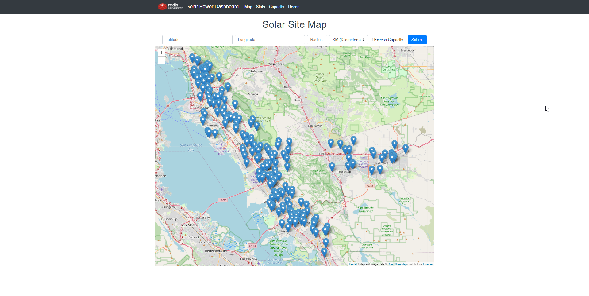

# RediSolar for Node.js



# Introduction

This is the sample application codebase for RU102JS, [Redis for JavaScript Developers](https://university.redis.com/courses/ru102js/) at [Redis University](https://university.redis.com).

Solutions to the course programming challenges can be found on the `solutions` branch.

# Prerequisites

In order to start and run this application, you will need:

- [Node.js](https://nodejs.org/en/download/) (We recommend using the current Long Term Stable version and have tested with version 18.4.2).
- npm (installed with Node.js).
- Access to a local or remote installation of [Redis Stack](https://redis.io/docs/stack/get-started/install/) - local preferred, we provide a Docker Compose file in this repo, read on for details.

If you're using Windows, check out the following resources for help with running Redis:

- [Redis Blog - Running Redis on Windows 10](https://redis.com/blog/redis-on-windows-10/)
- [Microsoft - Windows Subsystem for Linux Installation Guide for Windows 10](https://docs.microsoft.com/en-us/windows/wsl/install-win10)

# Setup

To get started, clone this repository:

```
$ git clone https://github.com/redislabs-training/ru102js.git
$ cd ru102js
```

Now install the dependencies:

```
$ npm install
```

You'll also need to have a Redis Stack instance running.  Either [install it locally](https://redis.io/docs/stack/get-started/install/), or use the Docker Compose file provided:

- Install [Docker](https://docs.docker.com/get-docker/) and [Docker Compose](https://docs.docker.com/compose/install/).
- Start up the Docker daemon.  
- Run ```docker-compose up -d``` in the project directory.  This command will give you Redis Stack on localhost port 6379 with no password required.  The container will persist Redis data to the ```redisdata``` folder.

You should see the following once the command has successfully run:

```
Creating network "ru102js_default" with the default driver
Creating redis_ru102js ... done
```

You'll also see the ```redis_ru102js``` container running if you open up the Docker app.  

If you want to shut down the Redis Stack container, use:

```
docker-compose down
```

# Configuration

The application uses a configuration file, `config.json` to specify the port that it listens
on plus some logging parameters and how it connects to a database.

The supplied `config.json` file is already set up to use Redis on localhost port 6379. Change these values if your Redis instance is on another host or port, or requires a password to connect.

```
{
  "application": {
    "port": 8081,
    "logLevel": "debug",
    "dataStore": "redis"
  },
  "dataStores": {
    "redis": {
      "host": "localhost",
      "port": 6379,
      "password": null,
      "keyPrefix": "ru102js"
    }
  }
}
```

The `keyPrefix` for Redis is used to namespace all the keys that the application generates or
references. So for example a key `sites:999` would be `ru102js:sites:999` when written to Redis.

# Load Sample Data

To load sample site data and sample metrics, run:

```
npm run load src/resources/data/sites.json flushdb
```

`flushdb` is optional, and will erase ALL data from Redis before inserting the sample data.

The application uses the key prefix `ru102js` by default, so you should be able to use the
same Redis instance for this application and other data if necessary.

# Development Workflow

In order to speed up development, you can run the application using `nodemon`, so that any
changes to source code files cause the server to reload and start using your changes.

```
npm run dev
```

Edit code, application will hot reload on save.

If you want to run without `nodemon`, use:

```
npm start
```

But you will then need to stop the server and restart it when you change code.

# Accessing the Front End Web Application

You should be able to see the front end solar dashboard app at:

```
http://localhost:8081/
```

# Running Tests

The project is setup to use [Jest](https://jestjs.io/en/) for testing. To run all tests:

```
npm test
```

To run a specific suite of tests (e.g. those in `tests/basic.test.js`):

```
npm test -t basic
```

To run Jest continuously in watch mode, which gives you access to menus allowing you to run
subsets of tests and many more options:

```
npm testdev
```

# Optional (but Recommended): RedisInsight

RedisInsight is a graphical tool for viewing data in Redis and managing Redis server instances.  You don't need to install it to be successful with this course, but we recommend it as a good way of viewing data stored in Redis.

To use RedisInsight, you'll need to [download it](https://redis.io/docs/ui/insight/) then point it at your Redis instance.  Check out the [RedisInsight documentation](https://redis.io/docs/ui/insight/) for help.

If you're using the Docker Compose file provided with this course to run Redis Stack, you can optionally choose to access a web-based version of Redis Stack at `http://localhost:8001` whenever the container is running.

# Linting

This project uses [ESLint](https://eslint.org/) with a slightly modified version of the
[Airbnb JavaScript Style Guide](https://github.com/airbnb/javascript).

- The file `.eslintrc` contains a short list of rules that have been disabled for this project.
- The file `.eslintignore` contains details of paths that the linter will not consider when
  linting the project.

To run the linter:

```
npm run lint
```

# Need Help / Join our Community

If you need help with the course or want to chat to your fellow students and the wider Redis community, please [join us on our Discord server](https://discord.gg/V2jj3qW).

# Subscribe to our YouTube Channel / Follow us on Twitch

We'd love for you to [check out our YouTube channel](https://youtube.com/redisinc), and subscribe if you want to see more Redis videos!  We also stream regularly on our [Twitch.tv channel](https://www.twitch.tv/redisinc) - follow us to be notified when we're live or checkout our [streaming schedule](https://developer.redis.com/redis-live/).
